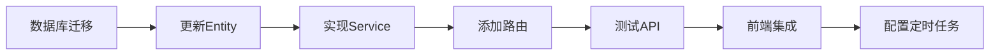

# 📘 Cloud-Mail 分享管理 MVP 优化实施计划

**版本**: 1.0.0
**日期**: 2025-10-12
**状态**: ✅ 前端完成 | ⏳ 后端待实现

---

## 🎯 核心目标

参考API接码平台的成熟UI设计，为邮箱验证码分享功能增加：
1. ✅ 批量操作能力（多选、批量延长、批量禁用/启用）
2. ✅ 状态可视化管理（active/expired/disabled）
3. ✅ Token刷新功能（安全更换分享链接）
4. ✅ 每日邮件统计展示（使用量控制）

---

## 📦 已完成交付物

### 1. **前端实现** ✅

#### **文件清单**：

| 文件路径 | 说明 | 状态 |
|---------|------|------|
| [mail-vue/src/views/share/index-mvp.vue](mail-vue/src/views/share/index-mvp.vue) | 完整的MVP版本管理界面 | ✅ 已创建 |
| [mail-vue/src/request/share.js](mail-vue/src/request/share.js:59-81) | 新增4个API方法 | ✅ 已更新 |

#### **新增API方法**：
```javascript
// 1. 刷新Token (第60-62行)
refreshShareToken(shareId)

// 2. 批量操作 (第65-71行)
batchOperateShares(action, shareIds, options)

// 3. 更新状态 (第74-76行)
updateShareStatus(shareId, status)

// 4. 更新限额 (第79-81行)
updateShareLimit(shareId, otpLimitDaily)
```

#### **UI特性对比**：

| 功能 | 现有版本 | MVP版本 | 参考截图 |
|------|---------|---------|----------|
| **多选功能** | ❌ | ✅ `<el-table-column type="selection">` | ✅ 第一列checkbox |
| **批量操作** | ❌ | ✅ 延长/禁用/启用按钮 | ✅ 顶部工具栏 |
| **状态显示** | ❌ | ✅ Tag标签+颜色区分 | ✅ 状态列 |
| **状态筛选** | ❌ | ✅ Radio按钮组 | ✅ 快速筛选 |
| **Token刷新** | ❌ | ✅ 刷新Token按钮 | ✅ 更换Token按钮 |
| **每日统计** | ❌ | ✅ 进度条+数量 | ✅ 今日邮件列 |
| **过期提醒** | ❌ | ✅ 剩余天数显示 | ✅ 到期倒计时 |

---

### 2. **数据库迁移脚本** ✅

**文件**: [migrations/001_add_mvp_fields.sql](migrations/001_add_mvp_fields.sql)

**新增字段**：
```sql
status TEXT DEFAULT 'active'                -- 状态枚举
otp_count_daily INTEGER DEFAULT 0           -- 今日邮件数
otp_limit_daily INTEGER DEFAULT 100         -- 每日限额
last_reset_date TEXT                        -- 最后重置日期
remark TEXT DEFAULT ''                      -- 备注信息
updated_at TEXT DEFAULT CURRENT_TIMESTAMP   -- 更新时间
```

**新增索引**：
```sql
idx_share_status                -- 状态查询优化
idx_share_expire_time           -- 过期时间查询优化
idx_share_user_status           -- 用户+状态组合查询
idx_share_user_expire           -- 用户+过期时间组合查询
```

**执行命令**：
```bash
# Cloudflare D1
wrangler d1 backup create cloud-mail-db  # 先备份
wrangler d1 execute cloud-mail-db --file=./migrations/001_add_mvp_fields.sql

# 本地SQLite
sqlite3 cloud-mail.db < ./migrations/001_add_mvp_fields.sql
```

---

## ⏳ 待实现：后端API

### **文件位置**: `mail-worker/src/service/share-service.js`

### **需要新增的方法**：

#### **1. refreshToken() - 刷新Token**

**对应前端API**: `refreshShareToken(shareId)` ([share.js:60-62](mail-vue/src/request/share.js:60-62))

**实现要点**：
```javascript
// 基于现有方法扩展（参考 share-service.js:58-99）
async refreshToken(c, shareId, userId) {
  const shareRow = await this.getById(c, shareId);

  // 权限检查
  if (shareRow.userId !== userId) {
    throw new BizError('无权操作', 403);
  }

  // 生成新Token（复用现有逻辑 share-service.js:38）
  const newToken = cryptoUtils.genRandomStr(32);

  // 更新数据库
  await orm(c).update(share)
    .set({
      shareToken: newToken,
      updated_at: new Date().toISOString()
    })
    .where(eq(share.shareId, shareId))
    .run();

  // 清除旧Token缓存（参考 share-service.js:81）
  const cacheManager = new CacheManager(c);
  await cacheManager.delete(`share:${shareRow.shareToken}`);

  // 返回新URL
  const baseUrl = getBaseUrl(c);
  return {
    shareToken: newToken,
    shareUrl: `${baseUrl}/share/${newToken}`
  };
}
```

---

#### **2. batchOperation() - 批量操作**

**对应前端API**: `batchOperateShares(action, shareIds, options)` ([share.js:65-71](mail-vue/src/request/share.js:65-71))

**实现要点**：
```javascript
async batchOperation(c, userId, action, shareIds, options = {}) {
  // 验证所有ID归属（安全检查）
  const shares = await orm(c).select().from(share)
    .where(and(
      sql`${share.shareId} IN (${shareIds.join(',')})`,
      eq(share.userId, userId)
    ))
    .all();

  if (shares.length !== shareIds.length) {
    throw new BizError('部分记录无权操作', 403);
  }

  switch (action) {
    case 'extend':
      // 延长有效期
      const newExpireTime = dayjs().add(options.extendDays, 'day').toISOString();
      await orm(c).update(share)
        .set({
          expireTime: newExpireTime,
          status: 'active',  // 重新激活
          updated_at: new Date().toISOString()
        })
        .where(sql`${share.shareId} IN (${shareIds.join(',')})`)
        .run();
      break;

    case 'disable':
      await orm(c).update(share)
        .set({
          status: 'disabled',
          updated_at: new Date().toISOString()
        })
        .where(sql`${share.shareId} IN (${shareIds.join(',')})`)
        .run();
      break;

    case 'enable':
      await orm(c).update(share)
        .set({
          status: 'active',
          updated_at: new Date().toISOString()
        })
        .where(sql`${share.shareId} IN (${shareIds.join(',')})`)
        .run();
      break;
  }

  return { success: true, affectedRows: shares.length };
}
```

---

#### **3. updateStatus() - 更新单个状态**

**对应前端API**: `updateShareStatus(shareId, status)` ([share.js:74-76](mail-vue/src/request/share.js:74-76))

**实现要点**：
```javascript
async updateStatus(c, shareId, userId, status) {
  const shareRow = await this.getById(c, shareId);

  if (shareRow.userId !== userId) {
    throw new BizError('无权操作', 403);
  }

  await orm(c).update(share)
    .set({
      status,
      updated_at: new Date().toISOString()
    })
    .where(eq(share.shareId, shareId))
    .run();

  return true;
}
```

---

#### **4. 增强getUserShares() - 返回计算字段**

**现有方法位置**: [share-service.js:109-129](mail-worker/src/service/share-service.js:109-129)

**需要增强的部分**：
```javascript
async getUserShares(c, userId, page = 1, pageSize = 20) {
  // ...现有查询逻辑

  const baseUrl = getBaseUrl(c);
  return shares.map(shareRow => {
    // 计算剩余天数
    const now = dayjs();
    const expire = dayjs(shareRow.expireTime);
    const daysRemaining = expire.diff(now, 'day');

    // 计算状态（如果未在数据库中）
    let status = shareRow.status;
    if (!status) {
      if (shareRow.isActive === 0) status = 'disabled';
      else if (now.isAfter(expire)) status = 'expired';
      else status = 'active';
    }

    return {
      ...shareRow,
      shareUrl: `${baseUrl}/share/${shareRow.shareToken}`,
      daysRemaining,  // 新增
      status,         // 确保存在
      // 可选：今日访问次数（需关联 share_access_log 表）
      // todayAccessCount: await this.getTodayAccessCount(c, shareRow.shareId)
    };
  });
}
```

---

### **路由配置位置**

**需要在以下文件添加路由**（具体路径需确认）：

```javascript
// 示例：mail-worker/src/hono/hono.js 或类似路由文件

// 刷新Token
app.post('/api/share/:shareId/refresh-token', authMiddleware, async (c) => {
  const shareId = parseInt(c.req.param('shareId'));
  const userId = c.get('userId');  // 从认证中间件获取

  const result = await shareService.refreshToken(c, shareId, userId);
  return c.json({ code: 200, data: result });
});

// 批量操作
app.post('/api/share/batch', authMiddleware, async (c) => {
  const { action, shareIds, extendDays } = await c.req.json();
  const userId = c.get('userId');

  const result = await shareService.batchOperation(
    c, userId, action, shareIds, { extendDays }
  );
  return c.json({ code: 200, data: result });
});

// 更新状态
app.patch('/api/share/:shareId/status', authMiddleware, async (c) => {
  const shareId = parseInt(c.req.param('shareId'));
  const { status } = await c.req.json();
  const userId = c.get('userId');

  await shareService.updateStatus(c, shareId, userId, status);
  return c.json({ code: 200, message: '状态更新成功' });
});
```

---

## 🤖 待实现：定时任务

### **文件位置**: `mail-worker/wrangler.toml` 和 `src/scheduled.js`

### **1. wrangler.toml 配置**

```toml
[triggers]
crons = [
  "0 0 * * *",     # 每天 0 点重置计数器
  "0 */6 * * *"    # 每 6 小时检查过期状态
]
```

### **2. scheduled.js 实现**

```javascript
// src/scheduled.js

import shareService from './service/share-service.js';

export default {
  async scheduled(event, env, ctx) {
    const c = { env };

    try {
      // 每天0点执行
      if (event.cron === "0 0 * * *") {
        // 重置每日计数器
        await resetDailyCounters(c);
        console.log('✅ 每日计数器已重置');
      }

      // 每6小时执行
      if (event.cron === "0 */6 * * *") {
        // 检查并更新过期状态
        await checkExpiredShares(c);
        console.log('✅ 过期状态已更新');
      }
    } catch (error) {
      console.error('❌ 定时任务执行失败:', error);
    }
  }
};

// 重置每日计数器
async function resetDailyCounters(c) {
  const today = dayjs().format('YYYY-MM-DD');

  await orm(c).update(share)
    .set({
      otp_count_daily: 0,
      last_reset_date: today,
      updated_at: new Date().toISOString()
    })
    .where(or(
      ne(share.last_reset_date, today),
      isNull(share.last_reset_date)
    ))
    .run();
}

// 检查并更新过期状态
async function checkExpiredShares(c) {
  const now = dayjs().toISOString();

  await orm(c).update(share)
    .set({
      status: 'expired',
      updated_at: new Date().toISOString()
    })
    .where(and(
      lte(share.expireTime, now),
      eq(share.status, 'active')
    ))
    .run();
}
```

---

## 📋 实施步骤（按顺序执行）

### **阶段1：数据库迁移（10分钟）**

```bash
# 1. 备份数据库
cd F:/Email/cloud-mail
wrangler d1 backup create cloud-mail-db

# 2. 执行迁移
wrangler d1 execute cloud-mail-db --file=./migrations/001_add_mvp_fields.sql

# 3. 验证结果
wrangler d1 execute cloud-mail-db --command="SELECT sql FROM sqlite_master WHERE name='share'"
wrangler d1 execute cloud-mail-db --command="SELECT status, COUNT(*) FROM share GROUP BY status"
```

---

### **阶段2：后端API实现（2-3小时）**

#### **2.1 更新Entity定义**

**文件**: `mail-worker/src/entity/share.js`

```javascript
// 添加新字段定义（在第15-16行之后）
export const share = sqliteTable('share', {
  // ...现有字段
  rateLimitPerMinute: integer('rate_limit_per_minute').default(60).notNull(),

  // 新增字段
  status: text('status').default('active').notNull(),
  otp_count_daily: integer('otp_count_daily').default(0).notNull(),
  otp_limit_daily: integer('otp_limit_daily').default(100).notNull(),
  last_reset_date: text('last_reset_date'),
  remark: text('remark').default(''),
  updated_at: text('updated_at').default(sql`CURRENT_TIMESTAMP`).notNull()
});
```

#### **2.2 实现Service方法**

**文件**: `mail-worker/src/service/share-service.js`

1. 添加 `refreshToken()` 方法
2. 添加 `batchOperation()` 方法
3. 添加 `updateStatus()` 方法
4. 增强 `getUserShares()` 方法

（具体代码见上方"待实现：后端API"部分）

#### **2.3 添加路由**

**文件**: `mail-worker/src/hono/hono.js` 或对应路由文件

添加3个新路由（见上方路由配置示例）

---

### **阶段3：定时任务配置（30分钟）**

#### **3.1 更新wrangler.toml**

```toml
# 在 wrangler.toml 末尾添加
[triggers]
crons = ["0 0 * * *", "0 */6 * * *"]
```

#### **3.2 创建scheduled.js**

```bash
# 创建文件
touch mail-worker/src/scheduled.js
# 复制上方的 scheduled.js 实现代码
```

#### **3.3 测试定时任务**

```bash
# 本地触发测试
wrangler dev --test-scheduled

# 部署后手动触发
wrangler d1 execute cloud-mail-db --command="UPDATE share SET last_reset_date='2025-01-01'"
# 等待定时任务执行，然后检查
wrangler d1 execute cloud-mail-db --command="SELECT last_reset_date FROM share LIMIT 5"
```

---

### **阶段4：前端集成测试（1小时）**

#### **4.1 替换现有页面**

```bash
# 备份现有文件
cp mail-vue/src/views/share/index.vue mail-vue/src/views/share/index.vue.backup

# 使用MVP版本
cp mail-vue/src/views/share/index-mvp.vue mail-vue/src/views/share/index.vue
```

#### **4.2 启动开发服务器**

```bash
cd mail-vue
npm run dev
```

#### **4.3 功能验证清单**

| 功能 | 测试步骤 | 预期结果 |
|------|---------|----------|
| **状态显示** | 刷新页面 | 所有分享显示正确的状态Tag |
| **状态筛选** | 点击"活跃"按钮 | 只显示status=active的记录 |
| **多选功能** | 勾选3个分享 | 显示"已选择 3 项" |
| **批量延长** | 点击"批量延长7天" | 弹出确认框，确认后显示成功提示 |
| **刷新Token** | 点击单个分享的"刷新Token" | 弹出警告，确认后自动复制新链接 |
| **每日统计** | 查看"今日邮件"列 | 显示进度条和数量（如 0/100） |

---

## ⚠️ 风险提醒

### **高风险操作**

1. **刷新Token** ⚠️
   - **风险**：旧链接立即失效，已分发给客户的链接无法访问
   - **应对**：前端已添加二次确认弹窗，建议后端记录Token变更历史

2. **批量操作** ⚠️
   - **风险**：误操作可能影响多个分享
   - **应对**：前端显示影响范围，要求二次确认

3. **数据库迁移** ⚠️
   - **风险**：SQLite不支持`DROP COLUMN`，回滚困难
   - **应对**：执行前必须备份，提供了完整的备份命令

---

## 🎯 验收标准

### **功能完整性**

- [x] 多选框正常工作
- [x] 批量操作按钮根据选择状态正确禁用/启用
- [x] 状态Tag显示正确的颜色和文本
- [x] 刷新Token有二次确认
- [x] 每日邮件统计显示进度条

### **数据准确性**

- [ ] 过期状态自动更新
- [ ] 每日计数器每天重置
- [ ] 批量操作影响正确数量的记录
- [ ] Token刷新后旧链接失效

### **性能要求**

- [ ] 列表加载时间 < 2秒
- [ ] 批量操作响应时间 < 3秒
- [ ] 状态筛选切换 < 500ms

---

## 📚 参考资料

### **相关文件位置**

| 类型 | 文件路径 | 说明 |
|------|---------|------|
| **前端MVP** | [mail-vue/src/views/share/index-mvp.vue](mail-vue/src/views/share/index-mvp.vue) | 完整UI实现 |
| **API定义** | [mail-vue/src/request/share.js](mail-vue/src/request/share.js) | 前端API方法 |
| **数据库迁移** | [migrations/001_add_mvp_fields.sql](migrations/001_add_mvp_fields.sql) | SQL脚本 |
| **现有Service** | [mail-worker/src/service/share-service.js](mail-worker/src/service/share-service.js) | 需扩展的后端服务 |
| **Entity定义** | [mail-worker/src/entity/share.js](mail-worker/src/entity/share.js) | 数据表结构 |

### **Element Plus 组件文档**

- [el-table 多选](https://element-plus.org/zh-CN/component/table.html#%E5%A4%9A%E9%80%89)
- [el-tag](https://element-plus.org/zh-CN/component/tag.html)
- [el-radio-group](https://element-plus.org/zh-CN/component/radio.html#radio-group)
- [el-progress](https://element-plus.org/zh-CN/component/progress.html)

---

## ✅ 下一步行动

**立即可执行**（无依赖）：
1. ✅ 数据库迁移（已提供完整脚本）
2. ⏳ 更新Entity定义（5分钟）
3. ⏳ 实现后端Service方法（2小时）

**依赖后端完成**：
4. ⏳ 测试前端集成
5. ⏳ 配置定时任务

**建议执行顺序**：


---

**需要我立即开始实施哪个阶段？**
